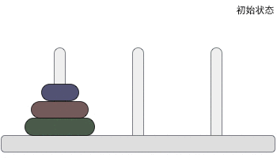

# Recursion Algorithm

## Introduction

&emsp;Recursive algorithm is an algorithm which directly or indirectly calls its own functions or methods. 
Simply put, it is the call of the program itself.
The essence of recursive algorithm is to decompose the problem into smaller sub-problems, and then recursively call methods to represent the solution of the problem.

## Characteristics of Recursive Algorithm

&emsp;Recursive algorithm can simplify complex problems and make the code more concise.
However, in the process of recursive call, the system opens up a stack for storing the return points and local quantities of each layer.
Too many times of recursion can easily cause stack overflow and low efficiency, so it is generally not recommended to use recursive algorithm to design programs.

## Design elements of Recursive Algorithm
1. Explicit recursion termination condition;
2. Extract repetitive logic to reduce the scale of the problem;
3. Give the processing method when recursion terminates.

## The cases of Recursive Algorithm

### The Calculation of factorial
&emsp;Factorial is a typical example of recursive algorithm. Factorial formula is n!=n\*(n-1)\*(n-2)\*...\*2\*1 .
For example, factorial(5)=5\*4\*3\*2\*1=120. 
The code for calculating factorial is as follows：

```
int factorial(int n){
	if(n==1){//base case
		return 1;
	}else{
		return n*factorial(n-1);
	}
}
```
&emsp;The stop position is called the base case. 
The base case is the lowest position of the recursive program. 
There is no need to operate at this position, and a result can be returned directly. 
All recursive programs must have at least one base case, and must ensure that they will eventually reach a certain base case; 
Otherwise, the program will run forever until it lacks memory or stack space. 

### Fibonacci sequence

&emsp;Fibonacci sequence was first used to describe the number of rabbits growing. 
Mathematically, Fibonacci sequence is defined by recursion. 


\[ f(0)=0 \\ f(1)=1 \\ f(n)=f(n-1)+f(n-2) \]


&emsp;Therefore, Fibonacci sequence recursion program code is as follows：

```
int Fibonacci(int n){
	if(n<=1)
		return n;
	else
		return Fibonacci(n-1)+Fibonacci(n-2);
}
```

### Hanoi Tower
&emsp;Hanoi Tower problem is also a classical recursive problem. 
The problem is described as follows：


> Hanoi Tower originates from an ancient Indian legend. 
When Brahma created the world, he made three diamond pillars, on which 64 gold discs were stacked in order of size from bottom to top. 
The Brahma ordered the Brahman to rearrange the disc from below on another pillar in order of size. 
It is also stipulated that **cannot put the large disk on the small disk at any time, and only one disk can be moved between three columns at a time**. 
How should we operate?

**Problem analysis**



* If there is only one disk, you do not need to use the C-pillar to move the disk directly from A to B.
* If there are two disks, you can move disk 2 on disk 1 to C first; Move disc 1 to B; And then move disc 2 to B. This shows that two discs can be moved from A to B with the help of C.
* If there are three discs, the moving process is shown in Figure 2. According to the conclusion of the two disks, the two disks on disk 1 can be moved from A to B with the help of C; Move disk 1 from A to C, and A becomes empty ; With the help of the A-pillar, move the two discs from B to C.

&emsp;So, the above idea can be extended to the case of n disks. 

1. Move n-1 disks on the starting column to the auxiliary column;
2. Move one disk left on the starting column to the target column;
3. Move all the disks on the auxiliary column to the target column.

&emsp;The code of Hanoi Tower is as follows：

```
#include <stdio.h>
/*num represents the number of disks.
source、target and auxiliary represent the starting column、the target column and the target column.*/
void hanoi(int num, char sou, char tar,char aux) {
    //Count the number of moves
    static int i = 1;
    //If the number of disks is only 1, move directly from the starting column to the target column
    if (num == 1) {
        printf("No.%d:move from %c to %c\n", i, sou, tar);
        i++;
    }
    else {
        //Call the hanoi () function recursively，Move num-1 discs from the starting column to the auxiliary column
        hanoi(num - 1, sou, aux, tar);
        //Move the last large disk remaining on the starting column to the target column
        printf("No.%d:move from %c to %c\n", i, sou, tar);
        i++;
        //Call the hanoi () function recursively to move the num-1 disk on the auxiliary column to the target column
        hanoi(num - 1, aux, tar, sou);
    }
}
int main()
{
    //Take moving 3 disks as an example, the starting column, target column and auxiliary column are represented by A, B and C respectively
    hanoi(3, 'A', 'B', 'C');
    return 0;
}
```

## Recursion and Loop

|          | Recursion | Loop |
| -------- | ---------------------------------------- | ---------------------------------- |
| repeat     | To obtain the result, execute the same code block repeatedly; Repeated execution is realized by repeatedly calling yourself as a signal. | To obtain the result, execute the same code block repeatedly; Repeat execution is achieved by completing the code block or executing the continue command signal. |
| Termination conditions | To ensure termination, recursive functions need to have a baseline condition to stop recursion. | To ensure that it can be terminated, the loop must have one or more conditions that can make it terminate, and must ensure that it can meet one of these conditions under certain circumstances. |
| state     | The current state is passed as a parameter. | Update the current state when the cycle is in progress. |

&emsp;Recursion has many similarities with loops. The difference is that the recursive function passes the new value as a parameter to the next function call, and rarely modifies the variable.
Therefore, it can avoid using updatable variables, and at the same time, it can conduct repetitive and stateful behavior.
## Reference

&emsp;[Detailed explanation of recursive algorithm](https://chenqx.github.io/2014/09/29/Algorithm-Recursive-Programming/)

&emsp;[Hanoi Tower problem (divide and conquer+source code+animation demonstration)](http://c.biancheng.net/algorithm/tower-of-hanoi.html)

&emsp;[Recursive algorithm (illustrated)](https://blog.csdn.net/lltqyl/article/details/106604387)
