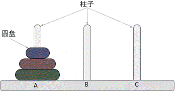

# 递归算法

## 概述

&emsp;&emsp;递归算法是一种直接或者间接调用自身函数或者方法的算法。简单来说就是程序自身的调用。
递归算法的本质是将问题不断分解为规模缩小的子问题，然后递归调用方法来表示问题的解。

## 递归算法的特点

&emsp;&emsp;递归算法可以将复杂问题简单化，使代码更加简洁。
但是，在递归调用的过程当中系统为每一层的返回点、局部量等开辟了栈来存储。
递归次数过多容易造成栈溢出，运行效率较低，所以一般不提倡用递归算法设计程序。

## 递归算法的设计要素
1. 明确递归终止条件
2. 提取重复逻辑，缩小问题规模
3. 给出递归终止时的处理方式

## 案例分析

### 阶乘计算
&emsp;&emsp;阶乘是典型的递归算法示例。阶乘公式是n!=n\*(n-1)\*(n-2)\*...\*2\*1。
例如5的阶乘是factorial(5)=5\*4\*3\*2\*1=120。计算阶乘代码如下：

```
int factorial(int n){
	if(n==1){//基线条件(base case)
		return 1;
	}else{
		return n*factorial(n-1);
	}
}
```
&emsp;&emsp;停止的位置称为基线条件（base case）。
基线条件是递归程序的最底层位置，在此位置时没有必要再进行操作，可以直接返回一个结果。
所有递归程序都必须至少拥有一个基线条件，而且必须确保它们最终会达到某个基线条件；
否则，程序将永远运行下去，直到程序缺少内存或者栈空间。

### 斐波那契数列

&emsp;&emsp;斐波纳契数列(Fibonacci Sequence)，最开始用于描述兔子生长的数目时用上了这数列。
从数学上，费波那契数列是以递归的方法来定义：


\[ f(0)=0 \\ f(1)=1 \\ f(n)=f(n-1)+f(n-2) \]


&emsp;&emsp;因此斐波那契数列递归程序代码如下：

```
int Fibonacci(int n){
	if(n<=1)
		return n;
	else
		return Fibonacci(n-1)+Fibonacci(n-2);
}
```

### 汉诺塔问题
&emsp;&emsp;汉诺塔问题也是一个经典递归问题。问题描述如下：



> 汉诺塔问题是一个经典的问题。汉诺塔（Hanoi Tower），又称河内塔，源于印度一个古老传说。
大梵天创造世界的时候做了三根金刚石柱子，在一根柱子上从下往上按照大小顺序摞着64片黄金圆盘。
大梵天命令婆罗门把圆盘从下面开始**按大小顺序重新摆放在另一根柱子上**。
并且规定，任何时候，**在小圆盘上都不能放大圆盘，且在三根柱子之间一次只能移动一个圆盘**。
问应该如何操作？

**问题分析**


* 如果只有 1 个圆盘，则不需要利用C柱，直接将盘子从A移动到B。
* 如果有 2 个圆盘，可以先将圆盘1上的圆盘2移动到C；将圆盘1移动到B；将圆盘2移动到B。这说明了：可以借助C将2个圆盘从A移动到B。
* 如果有3个圆盘，移动过程如图2所示。根据2个圆盘的结论，可以借助C将圆盘1上的两个圆盘从A移动到B；将盘子1从A移动到C，A变成空柱；借助A柱，将B上的两个圆盘移动到C。

&emsp;&emsp;以此类推，上述的思路可以一直扩展到 n 个圆盘的情况。

1. 将起始柱上的 n-1 个圆盘移动到辅助柱上；
2. 将起始柱上遗留的1个圆盘移动到目标柱上；
3. 将辅助柱上的所有圆盘移动到目标柱上。

&emsp;&emsp;汉诺塔问题代码如下：

```
#include <stdio.h>
//num 表示移动圆盘的数量，source、target、auxiliary 分别表示起始柱、目标柱和辅助柱
void hanoi(int num, char sou, char tar,char aux) {
    //统计移动次数
    static int i = 1;
    //如果圆盘数量仅有 1 个，则直接从起始柱移动到目标柱
    if (num == 1) {
        printf("第%d次:从 %c 移动至 %c\n", i, sou, tar);
        i++;
    }
    else {
        //递归调用 hanoi() 函数，将 num-1 个圆盘从起始柱移动到辅助柱上
        hanoi(num - 1, sou, aux, tar);
        //将起始柱上剩余的最后一个大圆盘移动到目标柱上
        printf("第%d次:从 %c 移动至 %c\n", i, sou, tar);
        i++;
        //递归调用 hanoi() 函数，将辅助柱上的 num-1 圆盘移动到目标柱上
        hanoi(num - 1, aux, tar, sou);
    }
}
int main()
{
    //以移动 3 个圆盘为例，起始柱、目标柱、辅助柱分别用 A、B、C 表示
    hanoi(3, 'A', 'B', 'C');
    return 0;
}
```

## 递归与循环

|          | 递归 | 循环 |
| -------- | ---------------------------------------- | ---------------------------------- |
| 重复     | 为了获得结果，反复执行同一代码块；以反复调用自己为信号而实现重复执行。 | 为了获得结果，反复执行同一代码块；以完成代码块或者执行 continue 命令信号而实现重复执行。 |
| 终止条件 | 为了确保能够终止，递归函数需要有一个基线条件，令函数停止递归。 | 为了确保能够终止，循环必须要有一个或多个能够使其终止的条件，而且必须保证它能在某种情况下满足这些条件的其中之一。 |
| 状态     | 当前状态作为参数传递。 | 循环进行时更新当前状态。 |

&emsp;&emsp;递归可以与循环转换，因此递归与循环有许多类似之处。
在函数式编程中，使用递归代替循环。
区别在于递归函数将新值作为参数传递给下一次函数调用，极少修改变量。
因此其可以避免使用可更新变量，同时能够进行重复的、有状态的行为。

## 参考

&emsp;&emsp;[递归算法详解](https://chenqx.github.io/2014/09/29/Algorithm-Recursive-Programming/)

&emsp;&emsp;[汉诺塔问题（分治+源码+动画演示）](http://c.biancheng.net/algorithm/tower-of-hanoi.html)

&emsp;&emsp;[全面理解递归](https://blog.csdn.net/lltqyl/article/details/106604387)

